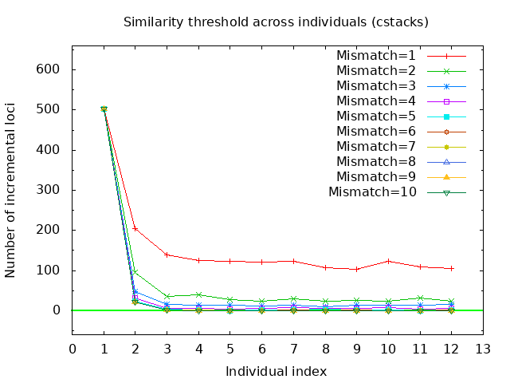

## A Tutorial To Run RADassembler

  Let's use [samples](samples/) as the examples.

  These simulated RAD datasets with random sheared ends from [GRCz11][GRCz11] were generated by ezmsim of [Rainbow][Rainbow].
  
  [GRCz11]: https://www.ncbi.nlm.nih.gov/assembly/GCF_000002035.6
  [Rainbow]: https://sourceforge.net/projects/bio-rainbow/files/

### The first step is to optimize M (mismatch within individual) for Stacks:

1. install RADassembler with all the needed components

    ```
    $bash INSTALL.sh
    ```

2. choose an individual (RAD reads containing enzyme cut sites), e.g. [fishsim-1.fq.gz](samples/read1/fishsim-1.fq.gz)

3. run chooseM, parameters details please see [here](README.md)

    ```
    $RADassembler chooseM samples/fishsim-1.fq.gz chooseM_out 10 8 3
    ```

    Once this is done, check the plots chooseM_ustacks.png or chooseM_ustacks.pdf in your chooseM_out folder.
    
    It looks like this:
    
    

    >The basic idea is to choose a mismatch value to maximize the number of loci with two alleles and simultaneously minimize the number of loci with one allele, 
    as described in Ilut <i>et al</i>. (2014).
    
    In this case, <font color="red">6</font> mismatches should be an appropriate value for chooseM.
    
### The second step is to optimize n (mismatch across individuals) for Stacks.

1. Select several individuals from each population. 
    e.g. 1 from 3 population, reads with enzyme cut sites in folder [read1](samples/read1), 
    and paired-end reads in folder [read2](samples/read2).

2. Run ustacks using the optimized mismatch value (i.e. M=6), as you get in the first steps.

    RADassembler provides the functions for a single run of ustacks on each individual. using such command line: 
    
    ```
    $RADassembler -i samples/read1 -s samples/read2 -P samples/PopMap -m 6 -o chooseN_out -R ustacks -t 8
    ```

3. Then run chooseN, parameters details please see [here](README.md)
    
    ```
    $RADassembler chooseN chooseN_out/stacks/ chooseN_out samples/PopMap 10 8
    ```

    Once this is done, check the plots chooseN_cstacks.png and chooseN_cstacks_total.png or the pdf version in outpath_cstacks folder.
    
    It looks like this:
    
    
    
    
    
    >The basic idea is to choose n (mismatch value across individuals), 
    such that the number of incremental loci for each merging individual using different mismatches changed little. 
    Or at the point of inflection, such that the total number of loci reach a plateau.
    
    In this case, <font color="red">6</font> or <font color="red">7</font> mismatches should be an appropriate value for chooseN, 
    similar to the AROUND N = M rules in Paris <i>et al</i>. (2017). 

### Then you can do the full de novo assembly by using RADassembler with the optimized similarity thresholds.
    
```
$RADassembler -i samples/read1 -s samples/read2 -P samples/PopMap -m 6 -n 6 -t 8 -o Assembly_out -D 10:100
```
    
Then check `collected_final.fa` file in `Assembly_out/Assembly` folder for the assembled RAD contigs.
    
Note: m in RADassembler is the parameter M for ustacks.

RADassembler is only for paired-end RAD-seq reads with random sheared ends (the original RAD protocol).

Please ajust parameters according to your data, details see https://github.com/lyl8086/RADscripts/tree/master/RADassembler

### References

>Ilut DC, Nydam ML, Hare MP. 2014 Defining loci in restriction-based reduced representation genomic data from nonmodel species: sources of bias and
diagnostics for optimal clustering. BioMed Res. Int. 2014, 675158. [[link]](http://dx.doi.org/10.1155/2014/675158)

>Paris JR, Stevens JR, Catchen JM, Johnston S. 2017 Lost in parameter space: a road map for stacks. 
Methods Ecol. Evol. 8, 1360-1373. [[link]](http://dx.doi.org/10.1111/2041-210X.12775)

###